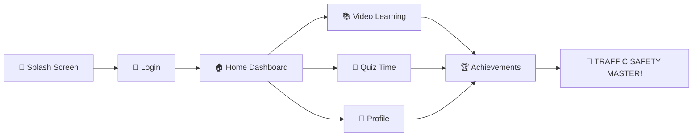

# 🚦 TrafficMate - Where Learning Traffic Rules Becomes an EPIC Adventure! 🏎️

<div align="center">

```
████████╗██████╗  █████╗ ███████╗███████╗██╗ ██████╗    ███╗   ███╗ █████╗ ████████╗███████╗
╚══██╔══╝██╔══██╗██╔══██╗██╔════╝██╔════╝██║██╔════╝    ████╗ ████║██╔══██╗╚══██╔══╝██╔════╝
   ██║   ██████╔╝███████║█████╗  █████╗  ██║██║         ██╔████╔██║███████║   ██║   █████╗  
   ██║   ██╔══██╗██╔══██║██╔══╝  ██╔══╝  ██║██║         ██║╚██╔╝██║██╔══██║   ██║   ██╔══╝  
   ██║   ██║  ██║██║  ██║██║     ██║     ██║╚██████╗    ██║ ╚═╝ ██║██║  ██║   ██║   ███████╗
   ╚═╝   ╚═╝  ╚═╝╚═╝  ╚═╝╚═╝     ╚═╝     ╚═╝ ╚═════╝    ╚═╝     ╚═╝╚═╝  ╚═╝   ╚═╝   ╚══════╝
```

[](https://flutter.dev)
[](https://dart.dev)
[](LICENSE)
[](https://github.com/nandinireddy-02/traffic-rules-app/stargazers)

### 🌟 Transform Kids into Traffic Safety Champions! 🌟

</div>

---

## 🎮 What Makes TrafficMate INSANELY Cool?

<table>
<tr>
<td width="50%">

### 🚀 **FEATURES THAT BLOW MINDS:**
- 🎯 **Grade-Aware Learning** - Adapts to your kid's level!
- 🎬 **Interactive Video Learning** - No boring textbooks!
- 🏆 **Gamified Quizzes** - Learning feels like playing!
- 📊 **Real-time Progress Tracking** - Watch them grow!
- 🎨 **Stunning UI/UX** - Eye-candy for everyone!
- 🌐 **Multi-Platform** - Web, iOS, Android - We got you!

</td>
<td width="50%">

```dart
// This is how AWESOME our code looks! 🔥
class TrafficMate extends StatelessWidget {
  @override
  Widget build(BuildContext context) {
    return MaterialApp(
      title: 'TrafficMate - Learn & Stay Safe!',
      theme: ThemeData(
        primarySwatch: Colors.blue,
        visualDensity: VisualDensity.adaptivePlatformDensity,
      ),
      home: SplashScreen(),
    );
  }
}
```

</td>
</tr>
</table>

---

## 🎪 **THE MAGIC HAPPENS HERE:**

<div align="center">



</div>

---

## 🛠️ **TECH STACK THAT ROCKS:**

<div align="center">

| Technology | Why We Chose It | Coolness Factor |
|------------|----------------|----------------|
|  | Cross-platform magic ✨ | 🔥🔥🔥🔥🔥 |
|  | Fast & Fun to code 🚀 | 🔥🔥🔥🔥 |
|  | State management ninja 🥷 | 🔥🔥🔥 |
|  | Smooth video experience 🎬 | 🔥🔥🔥🔥 |

</div>

---

## 🚀 **QUICK START GUIDE - LET'S GO CRAZY!**

### 🔥 **Step 1: Clone this BEAST**
```bash
git clone https://github.com/nandinireddy-02/traffic-rules-app.git
cd traffic-rules-app
```

### ⚡ **Step 2: Get Dependencies (THE POWER-UPS!)**
```bash
flutter pub get
```

### 🎊 **Step 3: LAUNCH THE MAGIC!**
```bash
# For Web (Chrome) 🌐
flutter run -d chrome

# For Android 📱
flutter run -d android

# For iOS (if you're on Mac) 🍎
flutter run -d ios
```

---

## 📱 **SCREENSHOTS THAT'LL MAKE YOU GO WOW!**

<div align="center">

| Splash Screen | Login Screen | Home Dashboard |
|---------------|--------------|----------------|
|  |  |  |

| Quiz Screen | Video Learning | Profile |
|-------------|----------------|---------|
|  |  |  |

</div>

---

## 🎯 **PROJECT STRUCTURE - ORGANIZED CHAOS!**

```
📦 TrafficMate
┣ 📂 lib/
┃ ┣ 📂 models/          # 🧠 The Brain Files
┃ ┣ 📂 screens/         # 🖥️ The Visual Magic  
┃ ┣ 📂 services/        # ⚙️ The Power Engine
┃ ┣ 📂 widgets/         # 🧩 Reusable Components
┃ ┗ 📜 main.dart        # 🚀 The Launch Pad
┣ 📂 assets/            # 🎨 Pretty Stuff Lives Here
┣ 📂 test/              # 🧪 Quality Assurance Lab
┗ 📜 pubspec.yaml       # 📋 The Dependency Bible
```

---

## 🌟 **CONTRIBUTORS HALL OF FAME**

<div align="center">

### 👑 **THE MASTERMINDS BEHIND THE MAGIC:**

<table>
<tr>
<td align="center">

<br />
<sub><b>🚀 Nandini Reddy</b></sub>
<br />
<sub>🎯 Lead Developer & Visionary</sub>
</td>
<td align="center">

<br />
<sub><b>🌟 YOUR NAME HERE</b></sub>
<br />
<sub>🔥 Future Contributor</sub>
</td>
</tr>
</table>

</div>

---

## 🎪 **WANT TO JOIN THE PARTY?**

<div align="center">

### 🚀 **CONTRIBUTING IS SUPER EASY!**

1. 🍴 **Fork** this repo
2. 🌿 **Create** a new branch (`git checkout -b feature/AmazingFeature`)
3. 💫 **Commit** your changes (`git commit -m 'Add some AmazingFeature'`)
4. 🚀 **Push** to the branch (`git push origin feature/AmazingFeature`)
5. 🎊 **Open** a Pull Request

### 📞 **NEED HELP? WE'RE HERE!**

[](https://discord.gg/yourserver)
[](mailto:nandinireddy02@gmail.com)

</div>

---

## 📄 **LICENSE - FREEDOM TO CREATE!**

This project is licensed under the MIT License - see the [LICENSE](LICENSE) file for details.

<div align="center">

### 🎊 **MADE WITH ❤️ BY PASSIONATE DEVELOPERS**

---

### 🚦 **"Teaching Traffic Safety, One App at a Time!"** 🚦

**⭐ Don't forget to STAR this repo if you think it's AWESOME! ⭐**

[](https://github.com/nandinireddy-02)
[](https://github.com/nandinireddy-02/traffic-rules-app)
[](https://github.com/nandinireddy-02/traffic-rules-app)

</div>

---

<div align="center">

```
🚦 DRIVE SAFE, CODE SAFER! 🚦
```

</div>